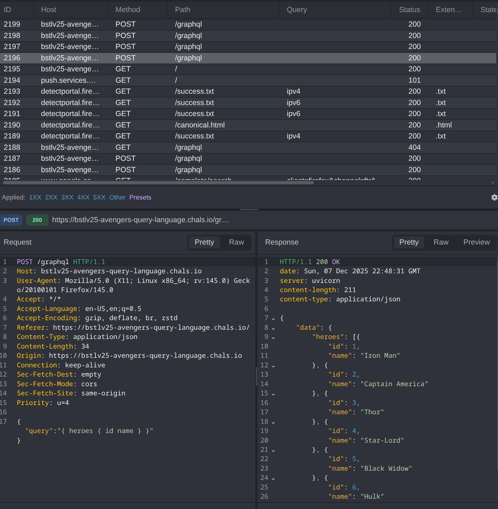

+++
date = '2025-12-08T00:49:15+02:00'
draft = false
title = 'Bsides Tlv Web 1'
+++

# BsidesTLV 2025 web ctf
### category : web
### difficulty : easy


overview :

we recieve a web app , avengers themed, i cant seem to find anything interesting but when inspecting the traffic i notice 4 /graphql POST requests which seem interesting to investigate



we actually manage to run an introspection request, good ..

```javascript
{"query":"{ __schema { types { name fields { name } } } }"}
```

we get an interesting output , especialy classifiedReports, lets further investigate..

```javascript

{"query":"{ classifiedReports { title content } }"}

```

and... we get the flag

BSidesTLV2025{*******}