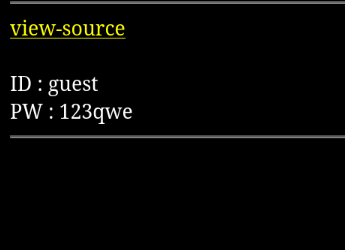

+++
date = '2025-12-07T11:43:39+02:00'
draft = false
title = 'Webhacking Kr Web06'
+++
# Webhacking.kr web-06
### category: web
### url to challenge : https://webhacking.kr/chall.php
### difficulty : not categorized

we start this challenge with a basic page that says the following :


### source code analysis

```javascript
<?php
include "../../config.php";
if($_GET['view_source']) view_source();
if(!$_COOKIE['user']){
  $val_id="guest";
  $val_pw="123qwe";
  for($i=0;$i<20;$i++){
    $val_id=base64_encode($val_id);
    $val_pw=base64_encode($val_pw);
  }
  $val_id=str_replace("1","!",$val_id);
  $val_id=str_replace("2","@",$val_id);
  $val_id=str_replace("3","$",$val_id);
  $val_id=str_replace("4","^",$val_id);
  $val_id=str_replace("5","&",$val_id);
  $val_id=str_replace("6","*",$val_id);
  $val_id=str_replace("7","(",$val_id);
  $val_id=str_replace("8",")",$val_id);

  $val_pw=str_replace("1","!",$val_pw);
  $val_pw=str_replace("2","@",$val_pw);
  $val_pw=str_replace("3","$",$val_pw);
  $val_pw=str_replace("4","^",$val_pw);
  $val_pw=str_replace("5","&",$val_pw);
  $val_pw=str_replace("6","*",$val_pw);
  $val_pw=str_replace("7","(",$val_pw);
  $val_pw=str_replace("8",")",$val_pw);

  Setcookie("user",$val_id,time()+86400,"/challenge/web-06/");
  Setcookie("password",$val_pw,time()+86400,"/challenge/web-06/");
  echo("<meta http-equiv=refresh content=0>");
  exit;
}
?>
<html>
<head>
<title>Challenge 6</title>
<style type="text/css">
body { background:black; color:white; font-size:10pt; }
</style>
</head>
<body>
<?php
$decode_id=$_COOKIE['user'];
$decode_pw=$_COOKIE['password'];

$decode_id=str_replace("!","1",$decode_id);
$decode_id=str_replace("@","2",$decode_id);
$decode_id=str_replace("$","3",$decode_id);
$decode_id=str_replace("^","4",$decode_id);
$decode_id=str_replace("&","5",$decode_id);
$decode_id=str_replace("*","6",$decode_id);
$decode_id=str_replace("(","7",$decode_id);
$decode_id=str_replace(")","8",$decode_id);

$decode_pw=str_replace("!","1",$decode_pw);
$decode_pw=str_replace("@","2",$decode_pw);
$decode_pw=str_replace("$","3",$decode_pw);
$decode_pw=str_replace("^","4",$decode_pw);
$decode_pw=str_replace("&","5",$decode_pw);
$decode_pw=str_replace("*","6",$decode_pw);
$decode_pw=str_replace("(","7",$decode_pw);
$decode_pw=str_replace(")","8",$decode_pw);

for($i=0;$i<20;$i++){
  $decode_id=base64_decode($decode_id);
  $decode_pw=base64_decode($decode_pw);
}

echo("<hr><a href=./?view_source=1 style=color:yellow;>view-source</a><br><br>");
echo("ID : $decode_id<br>PW : $decode_pw<hr>");

if($decode_id=="admin" && $decode_pw=="nimda"){
  solve(6);
}
?>
</body>
</html>

```

we can look that it performs some kind of custom encoding/decoding,

it encodes both password and username 20!! times in base64 and then hashes it using a basic number-symbol replacement and then sets the username and password as cookies lets check it out

```html
password = Vm0wd%40QyUXlVWGxWV0d%5EV%21YwZDRWMVl%24WkRSV0%21WbDNXa%21JTVjAxV%40JETlhhMUpUVmpBeFYySkVUbGhoTVVwVVZtcEJlRll%26U%40tWVWJHaG9UVlZ%24VlZadGNFSmxSbGw%21VTJ0V%21ZXSkhhRzlVVmxaM%21ZsWmFjVkZ0UmxSTmJFcEpWbTEwYTFkSFNrZGpTRUpYWVRGd%40FGcFdXbUZrUjFaSFYyMTRVMkpIZHpGV%40EyUXdZekpHYzFOdVVtaFNlbXhXVm0weGIxSkdXbGRYYlhSWFRWaENSbFpYZUZOVWJVWTJVbFJDVjAxdVVuWlZha%21pYWkVaT%40NscEdhR%40xTTW%21ob%21YxWlNTMkl%5EU%40tkWGJHUllZbGhTV0ZSV%40FFTlNiRnBZWlVaT%21ZXSlZXVEpWYkZKRFZqQXhkVlZ%21V%40xaaGExcFlXa%21ZhVDJOc%40NFZGhSMnhUVFcxb%40IxWXhXbE%26UTWtsNFUydGtXR0pIVWxsWmJGWmhZMVphZEdSSFJrNVNiRm9%24V%40xWYVQxWlhTbFpYVkVwV%21lrWktTRlpxUm%21GU%40JVbDZXa%21prYUdFeGNHOVdha0poVkRKT%40RGSnJhR%40hTYXpWeldXeG9iMWRHV%40%26STldHUlZUVlpHTTFSVmFHOWhiRXB%2AWTBac%21dtSkdXbWhaTW%26oWFkxWkdWVkpzVGs%21WFJVcElWbXBLTkZReFdsaFRhMlJxVW%21%5Ed%21dGbHNhRk%26OTVZweFUydDBWMVpyY0ZwWGExcHJZVWRGZUdOR%40JGaGhNVnBvVmtSS%21RtVkdjRWxVYldoVFRXNW9WVlpHWTNoaU%21XUnpWMWhvWVZKR%21NuQlVWM%21J%2AVGxaYWRFNVZPVmRpVlhCSVZqSjRVMWR0U%40tkWGJXaGFUVlp%24YUZwRlpGTlRSa%24B%26VGxaT%40FWSnRPVE%26XTW%26oWFdWWlJlRmRzYUZSaVJuQnhWV%24hrVTFsV%21VsWlhiVVpPVFZad%40VGVXlkREJXTVZweVkwWndXR0V%5EY0hKWlZXUkdaVWRPUjJKR%40FHaE%26WbkJ%40Vm%210U%21MxUnRWa%40RqUld%5EVllsZG9WRlJYTlc%26V%21ZscEhXVE%26vYVUxWFVucFdNV%40h%40V%21ZaS%21IxTnVRbFZXTTFKNlZHeGFZV%21JGTlZaUFZtUnBWbGhDU%21ZacVNqUlZNV%21IwVTJ0a%21dHSlhhR0ZVVnpWdlYwWnJlRmRyWkZkV%40EzQjZWa%40R%2ATVZkR%21NsWmpSV%24hYWWxoQ%21RGUnJXbEpsUm%21SellVWlNhRTFzU%40%26oV%21Z%2ARTBaREZrUjJKSVRtaFNhelZQVkZaYWQyVkdWWGxrUkVKWFRWWndlVmt%24V%40%26kWFIwVjRZMFJPV%40%21FeVVrZGFWM%40hIWTIxS%21IxcEhiRmhTVlhCS%21ZtMTBVMU%21%5EVlhoWFdHaFlZbXhhVjFsc%21pHOVdSbXhaWTBaa%40JHSkhVbGxhVldNMVlWVXhXRlZyYUZkTmFsWlVWa%40Q0VDFOSFJrZFJiRnBwVmtWVmQxWnRjRWRWTVZwMFVtdG9VRlp0YUZSVVZXaERUbFphU0dWSFJtcE%26WMUl%24VlRKMGIyRkdTbk%26UYkdoVlZsWndNMVpyV%40%21GalZrcDBaRWQwVjJKclNraFdSM%40hoVkRKR%21YxTnVVbEJXUlRWWVZGYzFiMWRHWkZkWGJFcHNVbTFTZWxsVldsTmhWa%24AxVVd%5Ed%21YySllVbGhhUkVaYVpVZEtTVk%26zYUdoTk%21VcFZWbGN%5ETkdReVZrZFdiR%21JvVW%26wc%40IxUldXbmRsYkZsNVkwVmtWMDFFUmpGWlZXaExWMnhhV0ZWclpHRldNMmhJV%21RJeFMxSXhjRWRhUlRWT%21VsaENTMVp0TVRCVk%21VMTRWbGhvV0ZkSGFGbFpiWGhoVm%21%5Ec%40NscEhPV%24BTYkhCNFZrY%24dOVll%5EV%40%26SVmJHaFhWak%26OTVZaWGMzaGpNVTUxWTBaa%21RtRnNXbFZXYTJRMFlURk9SMVp%21VGxoaVJscFlXV%24RvUTFkV%21draGtSMFpxVFdzMWVsZHJhRk%26oTVVsNVlVaENWbUpIYUVOYVJFWnJWakZhZEU%26V%21ZrNVdia0YzVmxjd0%21WTXhXa%40hUYkdob%21VqQmFWbFp0ZUhkTk%21WcHlWMjFHYWxacmNEQmFSV%21F%24VmpKS%40NsTnJhRmRTTTJob%21ZrUktSMVl%5EVG%26WVmJFSlhVbFJXV%21ZaR%21l%2ARmlNV%21JIWWtaV%21VsZEhhRlJVVm%21SVFpXeHNWbGRzVG%21oU%21ZFWjZWVEkxYjFZeFdYcFZiR%40hZVm%21%5Ed%21lWcFZXbXRrVmtwelZtMXNWMUl%2AYURWV0%21XUXdXVmRSZVZaclpGZGliRXB%26Vld0V%21MySXhiRmxqUldSc%21ZteEtlbFp0TURWWFIwcEhZMFpvV%40sxSGFFeFdNbmhoVjBaV%40NscEhSbGROTW%21oSlYxUkplRk%21%5EU%21hoalJXUmhVbXMxV0ZZd%21ZrdE%26iRnAwWTBWa%21dsWXdWalJXYkdodlYwWmtTR0ZHV%40xwaVdHaG9WbTE0YzJOc%21pISmtSM0JUWWtad0%26GWlhNVEJOUmxsNFYyNU9hbEpYYUZoV%40FrNVRWRVpzVlZGWWFGTldhM0I%40VmtkNFlWVXlTa%21pYV0hCWFZsWndSMVF%5EV%40tOVmJFSlZUVVF%24UFE9PQ%3D%3D

user = Vm0wd%40QyUXlVWGxWV0d%5EV%21YwZDRWMVl%24WkRSV0%21WbDNXa%21JTVjAxV%40JETlhhMUpUVmpBeFYySkVUbGhoTVVwVVZtcEJlRll%26U%40tWVWJHaG9UVlZ%24VlZadGNFSmxSbGw%21VTJ0V%21ZXSkhhRzlVVmxaM%21ZsWmFjVkZ0UmxSTmJFcEpWbTEwYTFkSFNrZGpSVGxhVmpOU%21IxcFZXbUZrUjA%21R%21UyMTRVMkpIZHpGV%21ZFb%24dWakZhV0ZOcmFHaFNlbXhXVm%21wT%21QwMHhjRlpYYlVaclVqQTFSMXBGV%40xOVWJGcFlaSHBHVjFaRmIzZFdha%21poVjBaT%40NtRkhhRk%26sYlhoWFZtMHhORmxWTUhoWGJrNVlZbFZhY%40xWcVFURlNNVlY%21VFZSU%21ZrMXJjRWxhU0hCSFZqRmFSbUl%2AWkZkaGExcG9WakJhVDJOdFJraGhSazVzWWxob%21dGWnRNWGRVTVZGM%21RVaG9hbEpzY0ZsWmJGWmhZMnhXY%21ZGVVJsTk%26WbFkxVkZaU%21UxWnJNWEpqUld%5EaFUwaENTRlpxUm%21GU%40JVbDZXa%21prYUdFeGNHOVdha0poVkRKT%40RGSnJhR%40hTYXpWeldXeG9iMWRHV%40%26STldHUlZUVlpHTTFSVmFHOWhiRXB%2AWTBac%21dtSkdXbWhaTVZwaFpFZFNTRkpyTlZOaVJtOTNWMnhXYjJFeFdYZE%26WVlpUWVRGd%21YxbHJXa%24RUUmxweFVtMUdVMkpWYkRaWGExcHJZVWRGZUdOSE9WZGhhMHBvVmtSS%21QyUkdTbkpoUjJoVFlYcFdlbGRYZUc%26aU%21XUkhWMjVTVGxOSGFGQlZiVEUwVmpGU%21ZtRkhPVmhTTUhCNVZHeGFjMWR0U%40tkWGJXaGFUVzVvV0ZreFdrZFdWa%24B%2AVkdzMVYwMVZiekZXYlhCS%21RWZEZlRmRZWkU%21V%21ZscFVXV%24RrVTFsV%21VsWlhiVVpPVFZad%40VGVXlkREJXTVZweVkwWndXR0V%5EY0ROV%40FrWkxWakpPU%21dKR%21pGZFNWWEJ%40Vm%210U%21MxUXlUWGxVYTFwb%21VqTkNWRmxZY0ZkWFZscFlZMFU%21YVUxcmJEUldNalZUVkd%5Ea%21NGVnNXbFZXYkhCWVZHdGFWbVZIUmtoUFYyaHBVbGhDTmxkVVFtRmpNV%21IwVTJ0a%21dHSlhhR0ZVVnpWdlYwWnJlRmRyWkZkV%40EzQjZWa%40R%2ATVZkR%21NsWmpSV%24hYWWxoQ%21RGUnJXbEpsUm%21SellVWlNhRTFzU%40%26oV%21Z%2AQjRUa%40RHUjFaWVpHaFNWVFZWVlcxNGQyVkdWblJOVldSV%21RXdHdWMWxyVW%21GWFIwVjRZMGhLV%40xaWFVrZGFWV%21JQVTBVNVYxcEhhR%40hOU0VKMlZtMTBVMU%21%5EVVhsVmEyUlZZbXR%24YUZWdGVFdGpSbHB%5EVkcwNVYxWnNjRWhYVkU%21dllWVXhXRlZ%21Y0ZkTlYyaDJWMVphUzFJeFRuVlJiRlpYVFRGS0%26sWkdVa%40RWTVZwMFVtdG9VRlp0YUZSVVZXaERVMnhhYzFwRVVtcE%26WMUl%24VlRKMGExZEhTbGhoUjBaVlZucFdkbFl%24V%40%26KbFJtUnlXa%21prVjJFelFqWldhMlI%40VFZaWmVWTnJaR%40hOTW%21oWVdWUkdkMkZHV%40xWU%40JGcHNVbTFTTVZVeWN%2ARlhSa%24BaVVc%21b%21YxWXphSEpVYTJSSFVqRmFXVnBIYUZOV%21ZGWldWbGN%5ETkdReVZrZFdXR%24hyVWpCYWNGVnRlSGRsYkZsNVpVaGtXRkl%24VmpSWk%21GSlBWMjFGZVZWclpHRldNMmhJV%21RJeFMxSXhjRWhpUm%21oVFZsaENTMVp0TVRCVk%21VMTRWbGhvV0ZkSGFGbFpiWGhoVm%21%5Ec%40NscEhPV%24BTYkhCNFZrY%24dOVll%5EV%40%26OalJXaFlWa%21UxZGxsV%21ZYaFhSbFp%26WVVaa%21RtRnNXbFZXYTJRMFdWWktjMVJ%21VG%21oU%40JGcFlXV%24hhUm%21ReFduRlJiVVphVm0xU%21NWWlhkRzloTVVwMFlVWlNWVlpXY0dGVVZscGhZekZ%24UlZWdGNFNVdNVWwzVmxSS0%21HRXhaRWhUYkdob%21VqQmFWbFp0ZUhkTk%21WcHlWMjFHYWxacmNEQmFSV%21F%24VmpKS%40NsTnJhRmRTTTJob%21ZrUktSMVl%5EVG%26WVmJFSlhVbFJXV%21ZaR%21l%2ARmlNV%21JIWWtaV%21VsZEhhRlJVVm%21SVFpXeHNWbGRzVG%21oU%21ZFWjZWVEkxYjFZeFdYcFZiR%40hZVm%21%5Ed%21lWcFZXbXRrVmtwelZtMXNWMUl%2AYURWV0%21XUXdXVmRSZVZaclpGZGliRXB%26Vld0V%21MySXhiRmxqUldSc%21ZteEtlbFp0TURWWFIwcEhZMFpvV%40sxSGFFeFdNbmhoVjBaV%40NscEhSbGROTW%21oSlYxUkplRk%21%5EU%21hoalJXUmhVbXMxV0ZZd%21ZrdE%26iRnAwWTBWa%21dsWXdWalJXYkdodlYwWmtTR0ZHV%40xwaVdHaG9WbTE0YzJOc%21pISmtSM0JUWWtad0%26GWlhNVEJOUmxsNFYyNU9hbEpYYUZoV%40FrNVRWRVpzVlZGWWFGTldhM0I%40VmtkNFlWVXlTa%21pYV0hCWFZsWndSMVF%5EV%40tOVmJFSlZUVVF%24UFE9PQ%3D%3D
```

this is quite long what shall we do with it? lets continue looking at the code,

it now performs decoding , it does the exact opposite of the encoding , in order to solve this challenge we need to get the following :

```javascript
if($decode_id=="admin" && $decode_pw=="nimda"){
  solve(6);
}
```

lets craft a solution my idea is to encode both admin and nimda 20 times in base 64 and then do the hashing, lets see if it works.


```python

#this function will recieve user and password input
# will encode its 20 times in base64 and finally will perform a matching type transformation

import base64
def transform_input(input_str):
    replacements = {
        '1': '!',
        '2': '@',
        '3': '$',
        '4': '^',
        '5': '&',
        '6': '*',
        '7': '(',
        '8': ')'
    }
    for old, new in replacements.items():
        input_str = input_str.replace(old, new)
    return input_str

def encode_base64_multiple_times(input_str, times=20):
    encoded = input_str.encode('utf-8')
    for _ in range(times):
        encoded = base64.b64encode(encoded)
    return encoded.decode('utf-8')

def main():
    user = input("Enter username: ")
    password = input("Enter password: ")


    encoded_user = encode_base64_multiple_times(user)
    encoded_password = encode_base64_multiple_times(password)

    transformed_user = transform_input(encoded_user)
    transformed_password = transform_input(encoded_password)


    print("Final User Hash:", transformed_user)
    print("Final Password Hash:", transformed_password)

if __name__ == "__main__":
    main()

```
let us test it on the provided credentials
guest, 123que :c they look identical except the fact that we might need
to url encode the output as well so lets fix it too and add a url encoding

now lets use the parameters admin and nimda and url encode the result

``` old-06 Pwned! ```
awesome it wasnt that hard just very messy in my opinion.